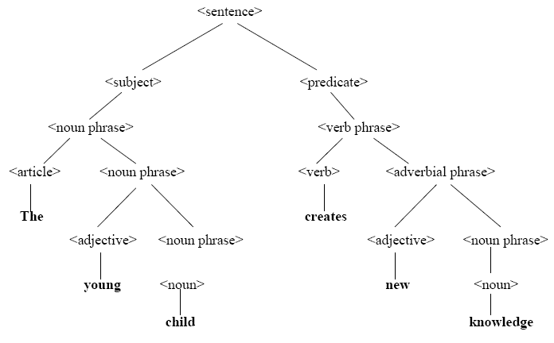
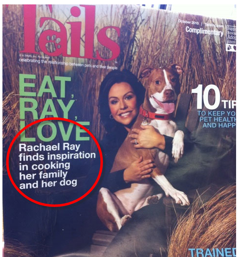

<!-- .slide: class="center" -->

# Intermediate Python

### Execution models

---

<!--
paginate: true
footer: 'Execution models'
-->

## Execution models

<span class="centered narrower">

- How is my code executed?
- Learning to think about code like Python does
- Code and data
- Values and types
- Syntax of a language
- Statements and expressions
- Operator precedence

</span>

---

## Execution models?

"Execution model" refers to the behaviour of a language.

---

## Execution models of a program

In order to understand what a program does, we must understand the execution model of the language we're working with.

---

## Execution models help us answer questions

<span class="centered narrower">

- What is _this_ line of code doing?
- What is my code doing?
- What is my program doing?

</span>

---

# Code and data

---

## Code and data

When we write programs, we do so by writing code.

---

## Writing code

We write `if` statements, `for` loops, variables, integers, strings, and so.

---

## Our code are the instructions for Python

_Print this._

_Go there._

_Do that._

_Always do this._

_Sometimes do that._

---

## Code and data

When we run our programs, Python will execute the code we wrote.

---

## Code and data

When we run our programs, Python will execute the instructions we provided.

---

## Code and data

And as part of executing our code, it will create data.

---

## Data

Data refers to the _values_ in our program. 

<br>

The _strings_, _integers_, _booleans_,

_dictionaries_, _lists_,

and even _functions_.

---

## Code and data

Not all code is data, but all data can be represented as code.

---

## Not all code is data

For example, `if` statements and `for` loops are just code.

---

## But all data can be represented as code

<span class="centered narrower">

- Strings: `"This is a string"`
- Integers: `123`
- Booleans: `True`
- Lists: `[7, 7, 7]`
- And so on.

</span>

---

## Code and data

<span class="center narrower">

The code that we write is stored in files in our hard-drives and can be made to run multiple times.

</span>

---

## Code and data

<span class="center narrower">

The data in our programs is stored in RAM and only "lives" for as long as our program is running.

</span>

---

# Values and types

---

## All values have a "type"

A "type" refers to the kind of data the value is.

---

## Types

<span class="centered narrower">

- String
- Boolean
- Integer
- Float
- List
- Dictionary
- Function
- And more.

</span>

---

## Values and types

All values have a "type".

---

## Values and types, and code and data

Values _are_ the data in our programs, therefore all data has a type.

---

## Values and types, and code and data

Code that is not data does not have a type.

---

## The type of a value

The type of a value helps us answer questions like,

_"What is this?"_

_"What can I do with this?"_

---

## Source of a value

Every value must come from somewhere.

---

## Every value must come from somewhere

<span class="center narrow">

Values must be declared, imported, or provided by Python. Otherwise you'll get this error <code>NameError: name '<variable name goes here>' is not defined</code>

</span>

---

# Syntax of a language

---

## Syntax of a language

The syntax of language refers to how the language can be written.

---



<!-- _footer: 'https://www.researchgate.net/figure/A-tree-representation-for-the-syntax-of-the-sentence-The-young-child-creates-new_fig2_320630490' -->

---

## How the language can be written

<span class="center narrower">

Knowing how a language can be written is important because it will allow us to write code that is _correct_.

</span>

---

## Code that is correct

<span class="center narrower">

Code is _correct_ when it can be executed by Python, _and_ when it does what we needed it to do.

</span>

---

## Code that is correct

Writing code that is correct is not easy, but it is possible.

---

## Code that is correct

<span class="center narrower">

Understanding the syntax of a language is the first step to understanding what a line of code will do, and therefore the first step to writing code that is correct.

</span>

---

## Syntax of a language

<span class="center narrower">

A language's syntax is a set of rules that describe how code must be written. These rules are the language's grammar.

</span>

---

## Specific example: by and until in English

<span class="centered wide">

1. Use _"by"_ to talk about a deadline. When we use "by" we are only concerned about the deadline or the time when something or some period ends.
	- We need to submit this _by_ 5 pm.
	- He must finish this _by_ next week.

2. We use _"until"_ to talk about the period of time from a starting point until a deadline or the end of some period of time. So, "by" only refers to the deadline, but "until" refers to all the time between now and the end of something.
	- I have to work _until_ 10 pm.
	- The store is open _until_ 1 am.

</span>

<!-- _footer: 'https://www.talkenglish.com/speaking/lessondetails.aspx?ALID=4398#:~:text=We%20use%20%22until%22%20to%20talk,report%20any%20day%20until%20Friday.' -->

---

## Generic example: verb/subject agreement in English

<span class="centered wide">

1. The verb in an or, either/or, or neither/nor sentence agrees with the noun or pronoun closest to it.
	- Neither the plates nor the serving bowl _goes_ on that shelf.
	- Neither the serving bowl nor the plates _go_ on that shelf.

</span>

<!-- _footer: 'https://www.grammarbook.com/grammar/subjectVerbAgree.asp' -->

---

## Punctuation example: colons in English

<span class="centered wide">

1. A colon can be used to separate two independent clauses when the second clause is directly related to the first clause (not just vaguely related), or when the emphasis is on the second clause. 
   - There are three types of muscle in the body: cardiac, smooth, and skeletal.

2. Colons can be used before a noun or a noun phrase.
   - The movie had everything I wanted: action and suspense. 

</span>

<!-- _footer: 'https://www.grammarly.com/blog/colon-2/' -->

---

## Grammar rules have impact on the meaning of a sentence



<!-- _footer: 'https://cybertext.files.wordpress.com/2011/03/comma.png' -->

---

## Grammar rules have impact on the meaning of a sentence


<!-- _footer: 'https://cybertext.files.wordpress.com/2011/03/comma.jpg' -->

---

## Programming languages also have a grammar

https://docs.python.org/3/reference/expressions.html

https://docs.python.org/3/reference/simple_stmts.html

https://docs.python.org/3/reference/compound_stmts.html

---

## A language's grammar

A grammar is described in specific format. This format is called EBNG, or just BNF sometimes.

---

**assignment statement**

```text
assignment_stmt ::=  (target_list "=")+ (starred_expression | yield_expression)
target_list     ::=  target ("," target)* [","]
target          ::=  identifier
                     | "(" [target_list] ")"
                     | "[" [target_list] "]"
                     | attributeref
                     | subscription
                     | slicing
                     | "*" target
					 
identifier   ::=  xid_start xid_continue*
id_start     ::=  <all characters in ...>
id_continue  ::=  <all characters in ...>
xid_start    ::=  <all characters in ...>
xid_continue ::=  <all characters in ...>
```

<!-- _footer: 'https://docs.python.org/3/reference/simple_stmts.html' -->

---

**if statement**

```text
if_stmt ::=  "if" assignment_expression ":" suite
             ("elif" assignment_expression ":" suite)*
             ["else" ":" suite]
```

**while loop**

```text
while_stmt ::=  "while" assignment_expression ":" suite
                ["else" ":" suite]
```

**for loop**

```text
for_stmt ::=  "for" target_list "in" starred_list ":" suite
              ["else" ":" suite]
```

<!-- _footer: 'https://docs.python.org/3/reference/compound_stmts.html' -->

---

# Statements and expressions

---

## Statements and expressions

Python's syntax is split into two types of structures: statements and expressions

---

## Statements and expressions

What's the difference?

---

## Statements and expressions

Expressions are values.

---

## Expressions are values

If it can go in the right-hand side of an assignment, it's an expression.

---

## Statements and expressions

Statements are everything else.

---

Let's use something that's a little simpler than EBNF

---

**assignment statement**

```text
assignment_statement ::= <variable_name> "=" <expression>
```

**if statement**

```text
if_statement ::= "if" <boolean_like_expression>
                 ":" <indented_code>
```

**while loop**

```text
while_loop_statement ::= "while" <boolean_like_expression>
                         ":" <indented_code>
```

**for loop**

```text
for_loop_statement ::= "for" <variable_name> "in" <list_like_expression>
                       ":" <indented_code>
```

---

**expressions, literals, and variables**

```text
lit_expression ::= <literal_value>
                 | <expression> <arithmetic_operator> <expression>
                 | <expression> <boolean_operator> <expression>
                 | <not_operator> <expression>

comp_expression ::= <variable>
                  | <list_index_access>
                  | <attribute_reference>
                  | <function_call>

expression ::= <lit_expression>>
             | <comp_expression>

literal_value ::= <integer>
                | <float>
                | <dictionary>
                | <list>
			 
variable ::= <any valid variable name>
```

---

**dictionary, list, accessors, and function calls**

```text
dictionary ::= "{"
                   <string> ":" <expression> ","
                   <string> ":" <expression> ","
                   <string> ":" <expression> "," ...
               "}"

list ::= "["
             <expression> ","
             <expression> ","
             <expression> "," ...
         "]"
		 
list_index_access ::= <list> "[" <integer> "]"
                    | <variable> "[" <integer> "]"
					
attribute_reference ::= <comp_expression> "." <variable>
                      | <comp_expression> "." <function_call>
					  
function_call ::= <comp_expression> "(" <expression> "," <expression> "," ... ")"
```

---

## Partial operator precedence

<table>
<tr><th>Order</th><th>Operator</th><th>Description</th></tr>
<tr><td>1</td><td><code>(), [], {}</code></td><td>Parenthesized expression, list, dictionary</td></tr>
<tr><td>2</td><td><code>x[index], x(arguments...), x.attribute</code></td><td>Subscription, call, attribute reference</td></tr>
<tr><td>3</td><td><code>**</code></td><td>Exponentiation</td></tr>
<tr><td>4</td><td><code>*, @, /, //, %</code></td><td>Multiplication, matrix multiplication, division, floor division, remainder</td></tr>
<tr><td>5</td><td><code>+, -</code></td><td>Addition and subtraction</td></tr>
</table>

<!-- _footer: 'https://docs.python.org/3/reference/expressions.html' -->

---

## Partial operator precedence (cont.)

<table>
<tr><th>Order</th><th>Operator</th><th>Description</th></tr>
<tr><td>6</td><td><code>in, not in, is, is not, <, <=, >, >=, !=, ==</code></td><td>Comparisons, including membership tests and identity tests</td></tr>
<tr><td>7</td><td><code>not x</code></td><td>Boolean NOT</td></tr>
<tr><td>8</td><td><code>and</code></td><td>Boolean AND</td></tr>
<tr><td>9</td><td><code>or</code></td><td>Boolean OR</td></tr>
</table>

<!-- _footer: 'https://docs.python.org/3/reference/expressions.html' -->

---
