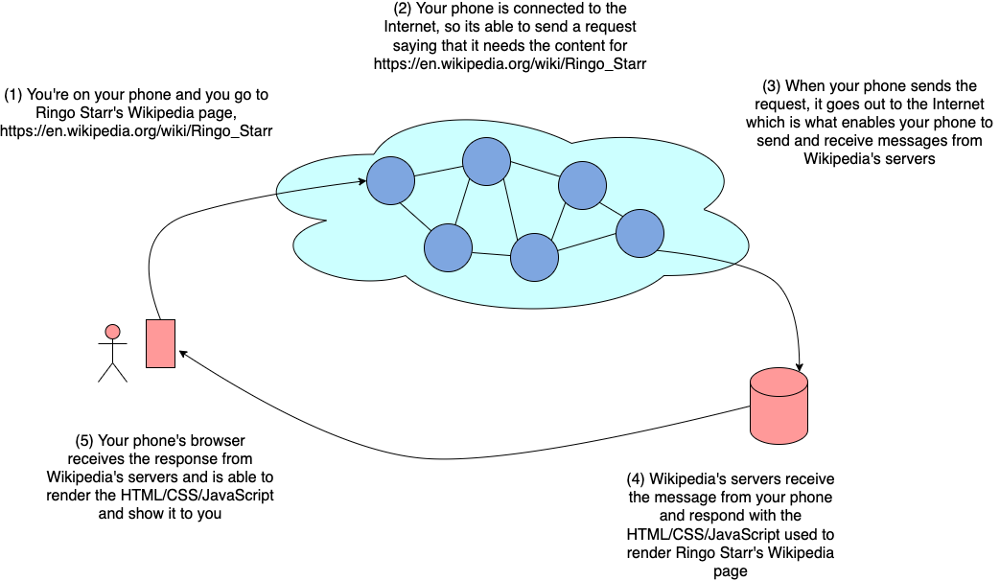
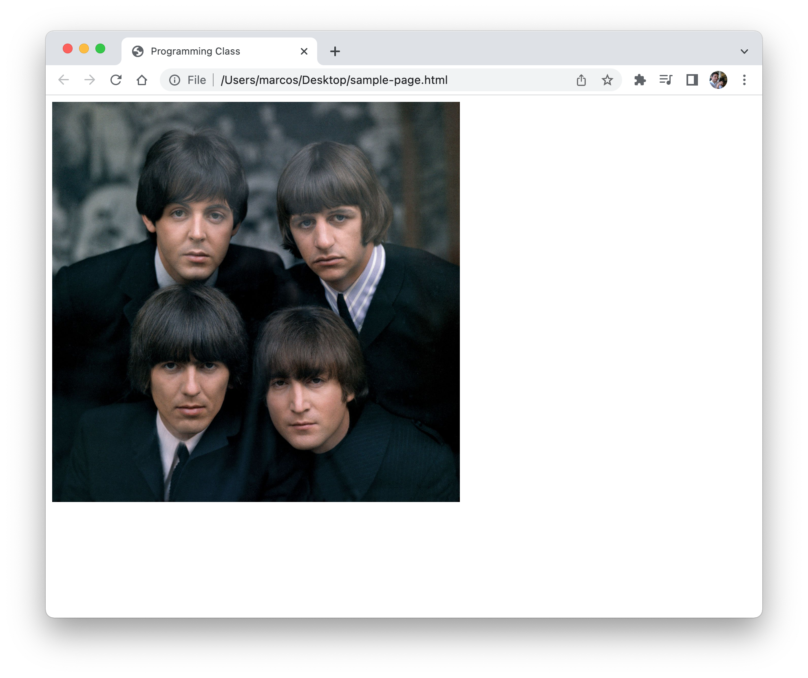

<!-- .slide: class="center" -->

# Introduction to Programming

### Unit 2: Web Programming

---

<!--
paginate: true
footer: 'Unit 2: Web Programming'
-->

<span class="center narrow">

In this unit we will start learning about web technologies that are used to build webpages and programs that use the web.

</span>

---

## Unit outline

<span class="centered">

- Why are we learning this?
- The Internet, aka "the web"
- Browsers, servers
- Webpages, HTML, and CSS
- Backend, frontend
- Networking basics
- Python and Flask

</span>

---

## Why are we learning this?

Much of our world is powered by the web.

---

## Why are we learning this?

Even when we're not browsing _the web_ on our _browsers_, we're likely on the web.

---

## Why are we learning this?

<span class="center narrow">

Everything is connected to the web: your phone, your watch, even your fridge might even be connected to the web.

</span>

---

## Why are we learning this?

<span class="center narrow">

But the primary use of the web is still the usage of webpages, and this is what we'll be learning about.

</span>

---

## Why are we learning this?

<span class="center narrow">

Being able to create programs that rely on _the web_ or _networking_ is an important part of being a software engineer.

</span>

---

## The Internet

When we talk about "the web" or "the net", we're referring to The Internet.

---

## What is The Internet?

<span class="center narrow">

The Internet is a global network of billions of computers and electronic devices that are able to talk to each other.

</span>

---

## Talking to each other

<span class="center narrow">

What is meant by "talking to each other" is simply the act of sending and receiving messages.

</span>

---

## Computers talking to each other

<span class="center narrower">

Computers and other electronic devices are able to talk to each other in different ways.

</span>

---

## Networks

When two or more computers talk to each other, they form a network.

---

## Networking

When two or more computers form a network they are said to be _networking_.

---

## Networking

<span class="center narrow">

We'll talk more about the basics networking in the near future, but know that networking is its own area of study in software engineering.

</span>

---

## Let's talk about how we use the web now

<span class="centered">

1. Let's say you want to learn more about Ringo Starr, so you look him up on Google.
2. On your phone's **browser**, you navigate to Google's **webpage** by going to www.google.com. This is known as a **URL**.
3. The webpage's URL allows your phone to find Google's computers which can show you the results. Computers that your phone talks to are referred to as **servers**.

</span>

---

## Browser

<span class="center narrow">

A browser is a computer program that is able to talk with other computers (or _servers_), ask for the contents of a _webpage_, and display them to you.

</span>

---

## Server

<span class="center narrow">

Servers are simply computers. They're a lot like the computer you're using right now but they're usually optimized to heavy usage.

</span>

---

## URL

<span class="center narrow">

URL stands for Uniform Resource Locator.

</span>

---

## URL

<span class="center narrow">

URL are addresses for a resource (a webpage is a resource) on the web.

</span>

---

## Webpage

<span class="center narrower">

A webpage, or a website, is all of the content that you see when using a browser.

</span>

---

## Webpage

Webpages are made with code.

---

## Webpage code

HTML, CSS, and JavaScript.

---

## HTML and CSS

HTML and CSS let you define the structure and style for your webpage.

---

## JavaScript

<span class="center narrow">

JavaScript is a programming language (just like Python is a programming language) that is able to interact with the webpage.

</span>

---

## JavaScript

<span class="center narrow">

Webpages are static, meaning that they won't change once they are rendered, but JavaScript is able to change the content of the webpage.

</span>

---

## JavaScript

JavaScript allows users to interact with your webpage.

---



---

## What are we going to continue learning about?

<span class="center narrow">

We're going to learn about HTML, CSS, and servers so that we can make our own webpages and programs that run on the web.

</span>

---

# HTML: HyperText Markup Language

---

## What is HTML for?

HTML is used to build webpages.

---

## What is HTML for?

HTML is a markup language.

---

## What is HTML for?

HTML lets us create the structure and the content of our webpages.

---

## HTML tags

HTML is made up of _HTML tags_.

---

## HTML example

```html
<!DOCTYPE html>
<html>
    <head>
        <title>Programming Class</title>
    </head>
    <body>
        <h1>Welcome to class</h1>
    </body>
</html>
```

---

## Different versions of HTML

<span class="narrow center">

HTML was released in the early 90's and there have been a few changes between then and now.

</span>

---

## Different versions of HTML

<span class="narrow center">

Because older versions of HTML are still supported, we have to tell the browser which version we're using.

</span>

---

## \<!DOCTYPE html>

<span class="narrow center">

We tell the browser that we're using the latest version by putting `<!DOCTYPE html>` at the beginning of the HTML file.

</span>

---

## \<!DOCTYPE html>

```html
<!DOCTYPE html>
<html>
    <body> ... </body>
</html>
```

---

## HTML tags

Different HTML tags do different things.

---

## HTML tags

For example, the `body` tags contains the webpage's body/content, the `table` tag renders a table, the `img` tag renders an image.

---

## Some HTML tags

<span class="narrow centered">

- `html` contains all of your webpage's HTML.
- `head` contains information that your browsers uses to render the page. Users don't see this.
- `meta` tells the browser how it should read your HTML file.
- `title` sets the page's title in the browser tag.
- `body` contains all of the content that the user sees.
- `h1` the largest text heading, there's also `h2`, `h3`, `h4`, `h5`, and `h6` which are each smaller than the previous one.

</span>

---

## HTML tags

Tags have a name (for example, `table`), and are surrounded by angle brackets: `<table>`

---

## HTML tags

There are start tags, `<table>`, and end tags `</table>`.

---

## Start and end tags

Start and end tags look the same except for the slash: `<table>`, `</table>`.

---

## Content

HTML tags can contain content.

---

## Content

The content goes between the start and end tag.

---

## Tags can contain text

```html
<h1>Welcome to class</h1>
```

---

## Tags can contain other tags

```html
<body>
    <h1>Welcome to class</h1>
</body>
```

---

## Self-closing tags

Some HTML tags don't have an end tag and they are said to be "self-closing": ``

---

## Self-closing tags

Self-closing tags don't have content, but they do have _attributes_.

---

## Attributes

Attributes are settings used by the browser when rendering a tag.

---

## Example attribute

```html
<!DOCTYPE html>
<html>
    <head>
        <title>Programming Class</title>
    </head>
    <body>
        
    </body>
</html>
```

---

## <code>\</code>

<br />
<br />



---

## Attributes are settings used by the browser when rendering a tag.

<span class="narrow center">

For example, in ``, `src` tells the browser where the image file can be found and `width` tells the browser how wide to render image.

</span>

---

## A tag's attributes

All tags can have attributes.

---

## A tag's attributes

But not all attributes work for all tags.

---

## A tag's attributes

`src` works in tags like `img`, but won't work in an `h1` tag.

---

## Where do tag attributes go?

Attributes go in the start tag. They _never_ go in the end tag.

---

## Common HTML tags (1)

<span class="narrow centered">

- `html` contains all of your webpage's HTML.
- `head` contains information that your browsers uses to render the page. Users don't see this.
- `meta` metadata used by the browser when processing your code.
- `title` sets the page's title in the browser tag.
- `style` contains CSS code.
- `link` link to an asset file, such as a CSS file.
- `script` link to JavaScript file.

</span>

---

## Common HTML tags (2)

<span class="narrow centered">

- `body` contains all of the content that the user sees.
- `table` a table that contains different parts of a table, such as rows.
- `tr` a table row that contains table cells.
- `td` a table cell that contains any content.
- `img` used to show an image on the page.
- `span` an inline element used as a container for content.
- `div` a block element used as a container for content.
- `center` an element that centers is content.

</span>

---

## Common HTML tags (3)

<span class="narrow centered">

- `h1` the largest text heading, there's also `h2`, `h3`, `h4`, `h5`, and `h6` which are each smaller than the previous one.
- `p` used to render a paragraph of text.
- `ol` ordered list of items. Contains `li` tags.
- `ul` un-ordered list of items. Contains `li` tags.
- `li` list item, goes inside an `ol` or `ul`.
- `a` link to another page or another part of the current page.
- `input` renders an input element, such as a text field.

</span>

---

But there are is so much more!

---

## MDN Web Docs is the best resource for anything related to web development

<br>


---

## MDN Web Docs is the best resource for anything related to web development

Links can be found at the end of the slides.

---

# CSS: Cascading Style Sheets

---

## What is CSS for?

CSS is used to style webpages.

---

## What is CSS for?

This means that CSS is able to change the look and feel of a webpage.

---

## What is CSS for?

<span class="narrow center">

For example, it can change the size of an element, the color of a header, the font in your page, and many other visual aspects.

</span>

---

## Sample CSS (whole page)

<br>

```html
<!DOCTYPE html>
<html>
    <head>
        <title>Programming Class</title>
        <style>

        img {
            width: 500px;
            margin: 10px 30px;
            border: 1px solid red;
        }

        h1 {
            color: green;
            font-family: "Times New Roman";
        }

        </style>
    </head>
    <body>
        <h1>Welcome to The Beatles fan club page.</h1>
        
    </body>
</html>
```

---

## Sample CSS (just the CSS)

<div class="w75 centered">

```css
img {
    width: 500px;
    margin: 10px 30px;
    border: 1px solid red;
}

h1 {
    color: green;
    font-family: "Times New Roman";
}
```

</div>

---

## Where does my CSS code go?

CSS can go in your `.html` file, but it must be inside a `style` tag.

---

## Where does my CSS code go?

<span class="center narrow">

CSS can also be included in other ways but we'll come back to this.

</span>

---

## CSS code

Let's talk about how CSS is written.

---

## CSS rules

<span class="center narrow">

You write CSS by writing _CSS rules_ where you can specially what properties you what to change for a set of elements.

</span>

---

## Here's what that means

<div class="w75 centered">

```css
img {
    margin: 10px;
    width: 500px;
}

h1 {
    color: green;
    font-family: "Times New Roman";
    font-size: 40px;
}
```

</div>

---

## CSS properties

<span class="center narrow">

_CSS properties_ style an aspect of an HTML element.

</span>

---

## Sample CSS properties

<div class="w75 centered">

<pre><code>h1 {
    <span class="highlight">color: green;</span>
    <span class="highlight">font-family: "Times New Roman";</span>
    <span class="highlight">font-size: 40px;</span>
}</code></pre>

</div>

---

## Syntax

CSS properties are written in the following way: `<property name>: <value>;`

---

## CSS selectors

<span class="center narrow">

_CSS selectors_ determines which HTML elements the style changes are intended for.

</span>

---

## Sample CSS selector

<div class="w75 centered">

<pre><code><span class="highlight">h1</span> {
    color: green;
    font-family: "Times New Roman";
    font-size: 40px;
}</code></pre>

</div>

---

## CSS rules

_CSS rules_ are the groupings of CSS selectors and the CSS properties.

---

## Sample CSS rule

<div class="w75 centered">

<pre><code><span class="highlight">h1 {
    color: green;
    font-family: "Times New Roman";
    font-size: 40px;
}</span></code></pre>

</div>

---

## CSS selectors

You can have one or more CSS selectors in a CSS rule.

---

## Example of multiple selectors in a rule

<div class="w75 centered">

```css
h1, h2, h3, p {
    color: orange;
}
```

</div>

---

## CSS selectors

<span class="centered">

- Tag selectors
- Class selectors
- ID selectors

</span>

---

## CSS selectors

<span class="center narrower">

There are more CSS selectors but those are the most common ones and what we'll learn about in this class.

</span>

---

## Tag selectors

CSS selectors can target elements by their tag name.

---

## Tag selectors

<div class="w75 centered">

```css
h1, h2, h3, p {
    color: orange;
}
```

</div>

---

## Class selectors

CSS selectors can target elements by their class.

---

## Class selectors

HTML elements can have a `class` attribute:
``

---

## Class selectors

The class can then be used to target those HTML elements in your CSS:

<div class="w75 centered">

```css
.large-image {
    width: 1000px;
}

.medium-image {
    width: 500px;
}

.small-image {
    width: 250px;
}
```

</div>

---

## Class selectors, syntax

Notice the dot (`.`) in `.large-image` is only used in CSS:

<div class="w75 centered">

```css
.large-image {
    width: 1000px;
}
```

</div>

Don't include it in your HTML:

<div class="w75 centered">

```html

```

</div>

---

## Matching HTML elements

CSS selector will target _all_ elements that match the criteria.

---

## Matching HTML elements

<span class="narrow centered">

This means that a rule like the one below will change how all images in your page look:

</span>

<div class="centered w75">

```css
img {
    width: 200px;
}
```

</div>

---

## Matching HTML elements

Class selectors can let you target specific elements.

---

## ID selectors

HTML elements can have an `id` attribute:
``

---

## ID selectors

<span class="narrow centered">

The ID can then be used to target those HTML elements in your CSS:

</span>

<div class="centered w75">

```css
#main-image {
    width: 1000px;
}
```

</div>

---

## Matching HTML elements

IDs are unique.

---

## Matching HTML elements

An ID corresponds to a single element in the page.

---

## Matching HTML elements

<span class="narrow centered">

This means that a rule like the one below will change how a single image in your page looks:

</span>

<div class="centered w75">

```css
#main-image {
    width: 200px;
}
```

</div>

---

## ID selectors, syntax

Notice the pound sign (`#`) in `#main-image` is only used in CSS:

<div class="w75 centered">

```css
#main-image {
    width: 200px;
}
```

</div>

Don't include it in your HTML:

<div class="w75 centered">

```html

```

</div>

---

## CSS selectors

<span class="centered">

- Tag selectors, example: style all `h1` elements.
- Class selectors, example: style all `p` elements with a class of `quote`.
- ID selectors, example: style single `img` element with an ID of `main-image`.

</span>

---

## CSS selectors, syntax

<span class="centered">

- Tag selectors, just use the tag name: `p`, `img`, `span`, `table`.
- Class selectors, put a dot before the class name: `.red`, `.large`, `.active`.
- ID selectors, put a pound sign before the ID: `#intro`, `#footer`.

</span>

---

## CSS inheritance

Styles trickle down from parent elements to child elements.

---

## Where does my CSS code go?

CSS can go in your `.html` file, but it must be inside a `style` tag.

---

## Where does my CSS code go?

<span class="center narrow">

CSS can also be placed into a separate `.css` file which can then be imported by your `.html` file with a `link` tag.

</span>

---

## Import CSS files

```html
<!DOCTYPE html>
<html>
    <head>
        <title>Programming Class</title>
        <link rel="stylesheet" href="text-styles.css" />
    </head>
    <body>
        <h1>Welcome to The Beatles fan club page.</h1>
        
    </body>
</html>
```

---

## Where does my CSS code go?

<span class="center narrow">

Finally, CSS can also be inlined in an element's `style` attribute.

</span>

---

## Common CSS properties

<span class="centered">

- `color` is used to change the color of text.
- `background-color` is used to change the background color of an element.
- `font-size` is used to change the font size.
- `font-family` is used to change the font used.
- `height` changes the height.
- `width` changes the width
- `border` is used to apply a border line around an element.
- `margin` is used to add spacing around (outside) the element.
- `padding` is used to add spacing inside the element.

</span>

---

But there are is so much more!

---

## MDN Web Docs is the best resource for anything related to web development

Links can be found at the end of the slides.

---

# Web Development

---

## Static vs. dynamic content

Static content is content that does not change.

---

## Static vs. dynamic content: static example

<span class="center narrow">

For example, if you create an HTML file and serve it on your website, any time you need to display new content you would have to modify your HTML file.

</span>

---

## Static vs. dynamic content

<span class="center narrow">

Dynamic content is content that is generated by a program, allowing it to change depending on logic written by a programmer.

</span>

---

## Static vs. dynamic content: dynamic example

<span class="center narrow">

For example, a web server that generates an HTML page with the current date and time.

</span>

---

## MDN Web Docs

<span class="centered">

- https://developer.mozilla.org
- https://developer.mozilla.org/en-US/docs/Web/HTML, HTML tutorial
- https://developer.mozilla.org/en-US/docs/Web/CSS, CSS tutorial

</span>
