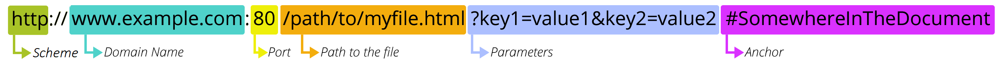

<!-- .slide: class="center" -->

# Intermediate Python

### Unit 3: Introduction to Flask

---

<!--
paginate: true
footer: 'Unit 3: Introduction to Flask'
-->

## Overview

<span class="centered narrower">

- What is Flask?
- Why are we learning this?
- The Internet, aka "the web"
- Writing Flask applications

</span>

---

# What is Flask?

---

Flask is a Python library.

---

<span class="center wide">

Flask is a library that lets us create **web applications** and **websites/webpages**.

</span>

---

<span class="center narrow">

Flask is a web framework.

</span>

---

<span class="center narrow">

Flask helps us build web servers.

</span>

---

<span class="center narrow">

Flask helps us build web servers that power our web applications.

</span>

---

## A note on terminology

<span class="center wide">

The terms **web application**, **website**, and **webpage** are all interchangeable and refer to a website that is accessed with a web browser.

</span>

---

# Why are we learning this?

---

## Why are we learning this?

<span class="center narrow">

Much of our world is powered by the web.

</span>

---

## Why are we learning this?

<span class="center wide">

Even when we're not browsing _the web_ on our _browsers_, we're likely on the web.

</span>

---

## Why are we learning this?

<span class="center narrow">

Everything is connected to the web: your phone, your watch, even your fridge might even be connected to the web.

</span>

---

## Why are we learning this?

<span class="center narrow">

But the primary use of the web is still the usage of webpages, and this is what we'll be learning about.

</span>

---

## Why are we learning this?

<span class="center narrow">

Being able to create programs that rely on _the web_ or _networking_ is an important part of being a software engineer.

</span>

---

# The Internet

---

## What is The Internet?

<span class="center narrow">

The Internet is a global network of billions of computers and electronic devices that are able to talk to each other.

</span>

---

## Talking to each other

<span class="center narrow">

What is meant by "talking to each other" is simply the act of sending and receiving messages.

</span>

---

## Talking to each other

<span class="center narrow">

The first computer sends a **request** for some data and the second computer **responds** to the request.

</span>

---

## Terminology

<span class="centered narrower">

- **Request**: a message sent by a computer, the sender, to another computer, the receiver.
- **Response**: a response to a message sent back from the receiver to the sender.

</span>

---

<span class="centered">

</span>

---

# Let's jump into the code

---

## Sample Flask application

```python
import flask

app = flask.Flask(__name__)

@app.get("/")
def index():
    return "Hello, world"

app.run()
```

---

## Let's break this down

<pre><code>import flask

app = flask.Flask(__name__)

@app.get("/")
def index():
    return "Hello, world"

app.run()</code></pre>

---

## Imports

<pre><code><span class="highlight">import flask</span>

app = flask.Flask(__name__)

@app.get("/")
def index():
    return "Hello, world"

app.run()</code></pre>

---

## Using imported code

<pre><code>import flask

app = <span class="highlight">flask.Flask(__name__)</span>

@app.get("/")
def index():
    return "Hello, world"

app.run()</code></pre>

---

## <code>\_\_name\_\_</code>

<pre><code>import flask

app = flask.Flask(<span class="highlight">__name__</span>)

@app.get("/")
def index():
    return "Hello, world"

app.run()</code></pre>

---

## Creating an application

<pre><code>import flask

<span class="highlight">app = flask.Flask(__name__)</span>

@app.get("/")
def index():
    return "Hello, world"

app.run()</code></pre>

---

## Running an application

<pre><code>import flask

app = flask.Flask(__name__)

@app.get("/")
def index():
    return "Hello, world"

<span class="highlight">app.run()</span></code></pre>

---

## Functions

<pre><code>import flask

app = flask.Flask(__name__)

@app.get("/")
<span class="highlight">def index():
    return "Hello, world"</span>

app.run()</code></pre>

---

<span class="center wide">

Whatever our function returns will be the response sent back to the client.

</span>

---

<span class="center wide">

Whatever our function returns will be what is displayed in our browser.

</span>

---

## Decorators

<pre><code>import flask

app = flask.Flask(__name__)

<span class="highlight">@app.get("/")</span>
def index():
    return "Hello, world"

app.run()</code></pre>

---

## Decorators

Decorators allow us to add functionality to out functions.

---

# Templates

---

## Routes can return HTML

```python
@app.get("/")
def index():
    return """
        <!DOCTYPE html>
        <html>
            <head>
                <title>Project: Recipe book</title>
            </head>
            <body>
                <h1>Recipe Book</h1>
                <h2>Contents</h2>

                ...
    """
```

---

## Routes can return HTML

But this can be cumbersome due to the length of the content.

---

## Templates

<span class="center narrow">

Flask provides a function named `render_template` that lets us move our HTML code into separate files.

</span>

---

<span class="tal">

**Contents of `templates/index.html`**

```jinja
<!DOCTYPE html>
<html>
    <body>
        <h1>Hello World!</h1>
    </body>
</html>
```

**Contents of `application.py`**

```python
from flask import Flask, render_template

# ...

@app.get("/")
def index():
    return render_template("index.html")

# ...
```

</span>

---

## Templates

<span class="center narrow">

This makes working with HTML easier because it's no longer a string in our Python code.

</span>

---

## Templates

Flask will look for your templates in the `templates`.

---

## Templates

Flask templates use a library called Jinja2.

---

## Jinja2

<span class="center">

Jinja2 offers functionality that lets you embed variables in your HTML code.

</span>

---

## Embedding variables

Embedded variables must be wrapped in `{{ }}`.

For example, `{{ name }}`.

---

<span class="tal">

**Contents of `templates/index.html`**

```jinja
<!DOCTYPE html>
<html>
    <body>
        <h1>Hello {{ name }}!</h1>
    </body>
</html>
```

**Contents of `application.py`**

```python
# ...

@app.get("/")
def index():
    return render_template("index.html", name="Marcos")

# ...
```

</span>

---

## Keyword arguments

<span class="center narrow">

When you call a function in Python and pass an argument to it, you can specify the name of the argument.

</span>

---

## Keyword arguments, an example

```python
def print_greeting(name):
    print("Hello " + name)

print_greeting("Ahmed")
print_greeting(name="Cindy")

name_to_greet = "Janira"
print_greeting(name=name_to_greet)
```

---

## Jinja2

<span class="center narrow">

Jinja2 also lets you embed code (that looks a lot like regular Python code) in your templates.

</span>

---

## Embedding code

Embedding code must be wrapped in ``.

For example, ``.

---

<span class="tal">

**Contents of `application.py`**

```python
# ...

driver_scores = {
    "Max Verstappen": 454,
    "Charles Leclerc": 308,
    "Sergio Perez": 305,
    "George Russell": 275,
    "Carlos Sainz": 246
}

@app.route("/")
def index_route():
    return render_template("index.html", driver_scores=driver_scores)

# ...
```

</span>

---

<span class="tal">

**Contents of `templates/index.html`**

```jinja
<body>
    
        
        <div class="winning">{{ driver }}: {{ score }}</div>
        
        <div class="losing">{{ driver }}: {{ score }}</div>
        
    
</body>
```

</span>

---

## Embedded code samples

```jinja

  {{ name }}



    Wow you're amazing!

    You're getting an A!

    Keep at it!

```

---

# URLs and routing

---

## URLs and routing

<span class="center narrow">

Let's breakdown what URLs are, how they work, and how they are used to navigate **to** and **within** our Flask applications.

</span>

---

## Let's start with definitions

<span class="center wide">

**URL**: an acronym for Uniform Resource Locator, URLs are the "address" of a resource (a webpage, a video, a photo, etc.) This resource can be in our own computer, or on another computer.

</span>

---

## URLs are addresses

URLs are addresses and they help us navigate The Internet to find and access a resource.

---

## URLs are addresses

By typing a URL into our browser's address bar, we send a request to the web server asking for what we need and it will response with the image/video/HTML/etc. that we asked for.

---

<span class="centered">

</span>

---

A web server is a program that is able to accept these requests and response appropriately.

---

Our Flask applications are web servers.

---

## Example URLs

<span class="centered">

- https://www.google.com
- https://www.youtube.com/watch?v=Z1RJmh_OqeA
- https://en.wikipedia.org/wiki/Computer_programming#Programming_languages
- https://upload.wikimedia.org/wikipedia/commons/d/df/The_Fabs.JPG

</span>

---

<!-- _footer: 'Unit 3: Introduction to Flask (image source: https://developer.mozilla.org/en-US/docs/Learn/Common_questions/Web_mechanics/What_is_a_URL' -->

<span class="centered">

</span>

---

## Scheme

<div class="ws-nw fs7 code">
<span class="highlight bold">http</span>://www.example.com:80/path/to/myfile.html?key1=value1&key2=value2#SomewhereInTheDocument
</div>

<hr />

The scheme indicates the protocol that must be used when talking to the server. This of a protocol as the "language" that must be used.

---

## Domain

<div class="ws-nw fs7 code">
http://<span class="highlight bold">www.example.com</span>:80/path/to/myfile.html?key1=value1&key2=value2#SomewhereInTheDocument
</div>

<hr />

The domain is the address for the web server that we are trying to reach.

---

## Domain (IP address)

<div class="ws-nw fs7 code">
http://<span class="highlight bold">159.89.240.57</span>:80/path/to/myfile.html?key1=value1&key2=value2#SomewhereInTheDocument
</div>

<hr />

<span class="center wide">

Since a domain corresponds to an IP address, An IP address may be used in place of the domain.

</span>

---

## Domain (local IP address)

<div class="ws-nw fs7 code">
http://<span class="highlight bold">127.0.0.1</span>:80/path/to/myfile.html?key1=value1&key2=value2#SomewhereInTheDocument
</div>

<hr />

<span class="center wide">

`127.0.0.1` is the IP address for your local computer.

</span>

---

## Domain (localhost)

<div class="ws-nw fs7 code">
http://<span class="highlight bold">localhost</span>:80/path/to/myfile.html?key1=value1&key2=value2#SomewhereInTheDocument
</div>

<hr />

<span class="center wide">

`localhost` is a special domain that corresponds to your local computer as well.

</span>

---

<!-- _footer: 'Unit 3: Introduction to Flask ([1] text source: https://developer.mozilla.org/en-US/docs/Learn/Common_questions/Web_mechanics/What_is_a_URL#authority' -->

## Port

<div class="ws-nw fs7 code">
http://www.example.com:<span class="highlight bold">80</span>/path/to/myfile.html?key1=value1&key2=value2#SomewhereInTheDocument
</div>

<hr />

<span class="center wide">

The port indicates the technical "gate" used to access the resources on the web server. It is usually omitted if the web server uses the standard ports of the HTTP protocol (80 for HTTP and 443 for HTTPS) to grant access to its resources. <span class="fs6 code">[1]</span>

</span>

---

## Path

<div class="ws-nw fs7 code">
http://www.example.com:80<span class="highlight bold">/path/to/myfile.html</span>?key1=value1&key2=value2#SomewhereInTheDocument
</div>

<hr />

<span class="center wide">

The path corresponds to the path or route of the resource on the web server.

</span>

---

## Path

<div class="ws-nw fs7 code">
http://www.example.com:80<span class="highlight bold">/path/to/myfile.html</span>?key1=value1&key2=value2#SomewhereInTheDocument
</div>

<hr />

<span class="center wide">

In Flask, this is what we use `@app.route` for.

</span>

---

## Path

<div class="ws-nw fs7 code">
http://www.example.com:80<span class="highlight bold">/path/to/myfile.html</span>?key1=value1&key2=value2#SomewhereInTheDocument
</div>

<div class="ws-nw fs7 code mt1">
http://www.example.com:80<span class="highlight bold">/more</span>?key1=value1&key2=value2#SomewhereInTheDocument
</div>

<hr />

<span class="center wide">

Paths may have multiple parts, each separated by a forward slash.

</span>

---

## Path

<div class="ws-nw fs7 code">
http://www.example.com:80<span class="highlight bold">/</span>?key1=value1&key2=value2#SomewhereInTheDocument
</div>

<hr />

`/` is the default path. When you see a URL without a path, it'll default to this. This path is referred to as the "index" path.

---

## Parameters

<div class="ws-nw fs7 code">
http://www.example.com:80/path/to/myfile.html<span class="highlight bold">?key1=value1&key2=value2</span>#SomewhereInTheDocument
</div>

<hr />

These are extra parameters (information) that is provided to the web server. These parameters are a list of key / value pairs (like a dictionary in Python) separated by `&`.

---

## Anchor

<div class="ws-nw fs7 code">
http://www.example.com:80/path/to/myfile.html?key1=value1&key2=value2<span class="highlight bold">#SomewhereInTheDocument</span>
</div>

<hr />

This is an anchor to a section in the webpage returned by the web server. This is used by browsers to scroll right to that section in the webpage.

---

<!-- _footer: 'Unit 3: Introduction to Flask (image source: https://developer.mozilla.org/en-US/docs/Learn/Common_questions/Web_mechanics/What_is_a_URL' -->

<span class="centered">

</span>

<span class="centered widest mt1">

- The **scheme** is used to determine which language to use when talking with the web server.
- The **domain name** is used to reach the web server.
- The **port** is used to pick the correct entry into the web server.
- The **path** and **parameters** are for the web server to use for whatever it wants.
- The **anchor** is used by the browser to scroll to the correct position.

</span>

---

## How do URLs relate to Flask applications?

<span class="centered widest mt1">

- The **scheme**, **domain name**, and **port** are used to reach the web server.
- The **path** is used by the web server (your Flask application) to determine what action it should perform and how it should respond.

</span>

---

# Links

---

## Links

<span class="center wide">

In HTML, links are created with the Anchor tag (`a`) and have an `href` attribute with the URL we would like to link to.

</span>

<hr />

```html
<a href="https://google.com">Click here to go to Google.com</a>
```

---

## Href attribute

You can use any valid URL in the `href` attribute.

<hr />

```html
<a href="https://www.google.com/search?q=Python">Click here to go to search for "Python"</a>
```

---

## Absolute URLs

<span class="center wide">

When a URL includes all of the usual parts (scheme, domain, port, path, etc.), it is referred to as an _absolute URL_.

</span>

<hr />

`https://www.google.com/search?q=Python`

---

## Relative URLs

<span class="center">

URLs that only include the path, query, and anchor are referred to as _relative URLs_.

</span>

<hr />

`/search?q=Python`

---

## Relative URLs

`/search?q=Python`

<hr />

<span class="centered">

</span>

---

## Relative URLs

<span class="center wide">

The parts of a relative URL that are left out (like the domain), are taken from the existing webpage that you are on.

</span>

---

## Relative URLs

<span class="center">

This means that when you are on `https://google.com`, when a user clicks on a link for `/search?q=Python` they will be taken to `https://google.com/search?q=Python`.

</span>

---

## Absolute vs. relative

<span class="centered">

- Absolute: `https://www.google.com/search?q=Python`
- Relative: `/search?q=Python`

</span>

---

## URLs in anchor tags

You can use both absolute and relative URLs in anchor tags.

<hr />

```html
<a href="https://www.google.com/search?q=Python">Search Google</a>

<a href="/search?q=Python">Search Google</a>
```

---

# HTTP / HTTPS

---

HTTP and HTTPS are the primary protocols used in The Web.

---

<span class="centered">

</span>

---

HTTP stands for _Hypertext Transfer Protocol_, and HTTPS stands for _Hypertext Transfer Protocol Secure_.

---

HTTP is a text protocol, meaning we can look at the contents of a request.

---

## Sample HTTP request

<pre><code>GET /wiki/HTTP HTTP/2
Host: en.wikipedia.org
Accept: text/html,application/xhtml+xml,application/xml;q=0.9,*/*;q=0.8
Accept-Encoding: gzip, deflate, br
Accept-Language: en-US,en;q=0.9
User-Agent: Mozilla/5.0 (Macintosh; Intel Mac OS X 10_15_7) ...</code></pre>

---

## The URL host and path

<pre><code>GET <b class="highlight">/wiki/HTTP</b> HTTP/2
Host: <b class="highlight">en.wikipedia.org</b>
Accept: text/html,application/xhtml+xml,application/xml;q=0.9,*/*;q=0.8
Accept-Encoding: gzip, deflate, br
Accept-Language: en-US,en;q=0.9
User-Agent: Mozilla/5.0 (Macintosh; Intel Mac OS X 10_15_7) ...</code></pre>

---

## The HTTP method

<pre><code><b class="highlight">GET</b> /wiki/HTTP HTTP/2
Host: en.wikipedia.org
Accept: text/html,application/xhtml+xml,application/xml;q=0.9,*/*;q=0.8
Accept-Encoding: gzip, deflate, br
Accept-Language: en-US,en;q=0.9
User-Agent: Mozilla/5.0 (Macintosh; Intel Mac OS X 10_15_7) ...</code></pre>

---

## HTTP methods

<span class="centered">

- <b><code>GET</code></b>, requests a representation of the specified resource. Requests using GET should only retrieve data.
- <code>HEAD</code>, asks for a response identical to a GET request, but without the response body.
- <b><code>POST</code></b>, submits an entity to the specified resource, often causing a change in state or side effects on the server.
- <b><code>PUT</code></b>, replaces all current representations of the target resource with the request payload.
- <b><code>DELETE</code></b>, deletes the specified resource.
- <code>CONNECT</code>, establishes a tunnel to the server identified by the target resource.
- <code>OPTIONS</code>, describes the communication options for the target resource.
- <code>TRACE</code>, performs a message loop-back test along the path to the target resource.
- <code>PATCH</code>, applies partial modifications to a resource.

</span>

<!-- _footer: 'Unit 3: Introduction to Flask (source: https://developer.mozilla.org/en-US/docs/Web/HTTP/Methods)' -->

---

## Sample HTTP response

<pre><code>HTTP/2 200
Content-Type: text/html; charset=UTF-8
Last-Modified: Mon, 08 May 2023 11:41:03 GMT
Age: 33352
Content-Encoding: gzip
Content-Language: en
Date: Mon, 08 May 2023 11:42:37 GMT
Content-Length: 63200

&lt;!DOCTYPE html&gt;
&lt;html&gt;&lt;head&gt;...</code></pre>

---

## Response code

<pre><code>HTTP/2 <b class="highlight">200</b>
Content-Type: text/html; charset=UTF-8
Last-Modified: Mon, 08 May 2023 11:41:03 GMT
Age: 33352
Content-Encoding: gzip
Content-Language: en
Date: Mon, 08 May 2023 11:42:37 GMT
Content-Length: 63200

&lt;!DOCTYPE html&gt;
&lt;html&gt;&lt;head&gt;...</code></pre>

---

## HTTP response status codes

<span class="centered">

- 100 to 199, Informational responses
- 200 to 299, Successful responses
    - `200 OK`
- 300 to 399, Redirection messages
    - `301 Moved Permanently`, `302 Found`
- 400 to 499, Client error responses
    - `400 Bad Request`, `404 Not Found`
- 500 to 599, Server error responses
    - `500 Internal Server Error`, `502 Bad Gateway`

</span>

<!-- _footer: 'Unit 3: Introduction to Flask (source: https://developer.mozilla.org/en-US/docs/Web/HTTP/Status)' -->

---
