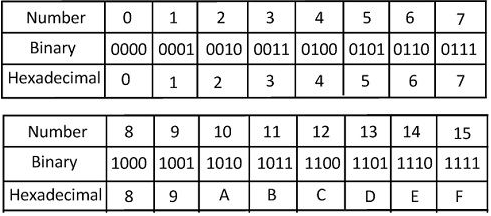

<!-- .slide: class="center" -->

# Intermediate Python

### Unit 4: File IO

---

<!--
paginate: true
footer: 'Unit 4: File IO'
-->

## Overview

<span class="centered narrower">

- Understand the use cases for File IO
- Understand the basics of file input/output in Python
- Read data from files using different file modes and methods.
- Write data to files and create new files.

</span>

---

## A Quick Review

<span class="center wide">

Binary, Hexadecimal, Data

</span>

<span class="centered">

</span>

---

<span class="center wide">

Encoding Data

</span>

<span class="centered">

</span>

---

## File IO In Python

<span class="center wide">

What File IO looks like in Python

</span>

```python
file = open('filename.txt', 'r') # <- Open 'filename.txt' in 'read' mode
content = file.read()
print(content)
file.close()
```

---

### File Modes

<span class="center wide">

We can open Files in different ways

</span>

---

**Write Mode ('w'):**

```python
file = open('filename.txt', 'w')
file.write('Hello, World!')
lines = ["hello", "World"]
file.writelines(lines)
file.close()
```

---

**Append Mode ('a'):**

```python
file = open('filename.txt', 'a')
file.write('This line will be appended.')
file.close()
```

---

**Read-Write Mode ('r+'):**

```python
file = open('filename.txt', 'r+')
content = file.read()
print(content)
file.write('\nThis line will be added at the end.')
file.close()
```

---

### Commmon Formats For Saving Data

<span class="centered narrower">

- **Plain Text**: 
- **Comma-Separated Values**: 
- **JSON (JavaScript Object Notation)**:

</span>

---

#### Plain Text

<span class="centered narrower">

Exactly what you think

```
Hello World
This is an example of plain text
It is Human readable
```

</span>

---

#### Comma-Separated Values

<span class="centered narrower">


- Values are seperated by commas (Duh)
- Each line represents a piece of data

For a menu...

```
price,name,description
10.00, Fried Chicken, The best fried chicken you've ever had
5.00, Hamburger, It has ham in the name, but it's not ham at all
2.50, French Fries, Delicious, but didnt actually originate in france. 
```

</span>

---

##### Opening A CSV File

```python
file_path = '/path/to/file.csv'

# Open the file in read mode
file = open(file_path, 'r')
lines = file.readlines()
for line in lines:
    values = line.split(',')

    # Access the values by index and perform desired operations
    price = values[0]
    name = int(values[1])
    description = values[2]

    print(f"Price: {price}, name: {name}, Description: {description}")
file.close()
```

---

#### JSON (JavaScript Object Notation)

<span class="centered narrower">


- Format is easy for humans to read and write and easy for machines to parse and generate
- Widely used for transmitting data between a server and a web application
- Data is represented as **key-value pairs**, where keys are strings and values can be of any supported JSON data type. 
- **Denoted by curly braces ({}) with keys and values separated by colons (:)**
- Supports ordered lists of values using arrays, denoted by square brackets ([]).
- Supports unordered collections of key-value pairs, .

---

```json
[
  {
    "name": "Fried Chicken",
    "price": 10.00,
    "description": "The best fried chicken you've ever had."
  },
  {
    "name": "Hamburger",
    "price": 5.00,
    "description": "It has ham in the name, but it's not ham at all."
  },
  {
    "name": "French Fries",
    "price": 2.50,
    "description": "Delicious, but didnt actually originate in france."
  }
]
```

</span>

---

##### Opening A JSON file

<span class="centered narrower">


```python
import json

file_path = '/path/to/file.json' 

file = open(file_path, 'r')
json_data = json.load(file)
print(json_data)

file.close()
```

</span>

---

#### Let's build A forum!

<span class="centered narrower">

```python
from flask import Flask, render_template, request, redirect

app = Flask(__name__)
messages = []  # List to store forum messages


@app.route('/')
def home():
    return render_template('index.html', messages=messages)


@app.route('/post', methods=['POST'])
def post_message():
    username = request.form['username']
    message = request.form['message']
    messages.append({'username': username, 'message': message})
    return redirect('/')


if __name__ == '__main__':
    app.run()
```

</span>